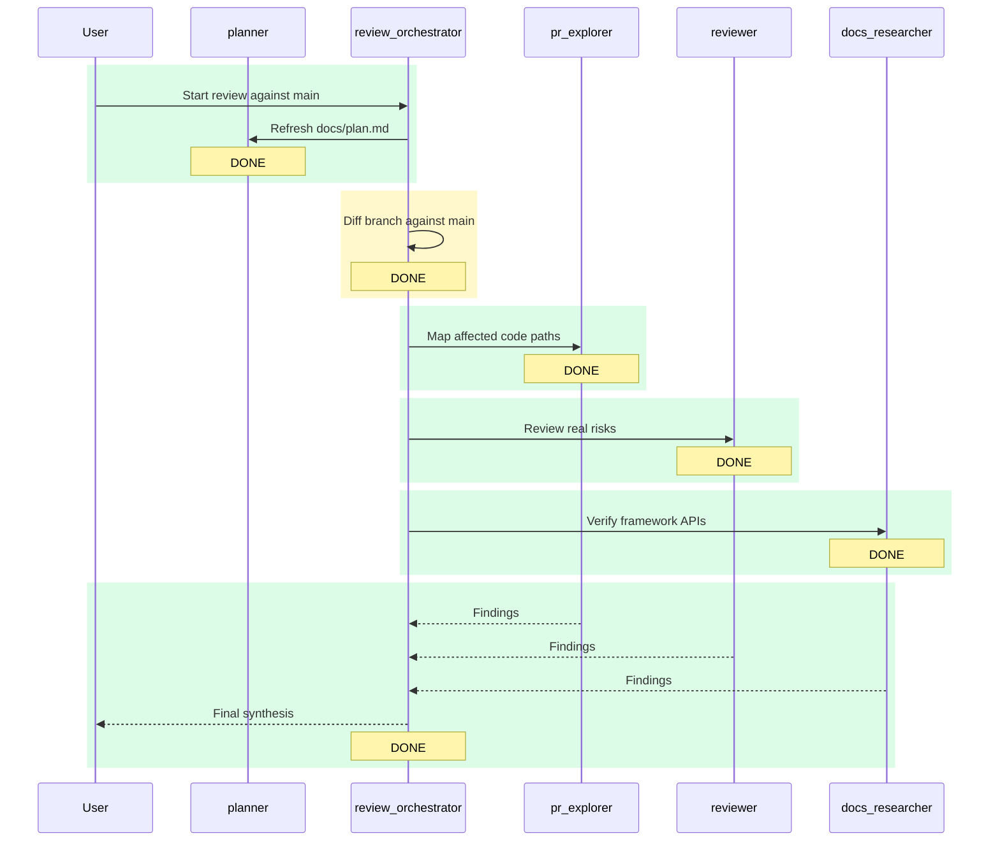

# Execution Plan

## Objective

Review the current `branchdemo` branch against `main` for correctness, regressions, security issues, and missing tests.

## Status Summary

- Overall status: `DONE`
- Current phase: `Review synthesis completed`
- Comparison target: `main`
- Branch context: `branchdemo` is ahead of `origin/branchdemo` by 4 commits

## Participants

| Agent | Role | Status |
| --- | --- | --- |
| `planner` | Plan owner and live tracker | `DONE` |
| `review_orchestrator` | Review coordinator | `DONE` |
| `pr_explorer` | Code-path mapping | `DONE` |
| `reviewer` | Risk review | `DONE` |
| `docs_researcher` | API verification | `DONE` |

## Tasks

| Task | Owner | Status | Notes |
| --- | --- | --- | --- |
| Refresh `docs/plan.md` | `planner` | `DONE` | Live tracker initialized with current branch context |
| Diff branch against `main` | `review_orchestrator` | `DONE` | Diff scope confirmed: repo config, agent config, docs tracker, dev-server changes |
| Map affected code paths | `pr_explorer` | `DONE` | Diff is concentrated in dev tooling, agent config, and workflow docs; no app route/component changes detected |
| Review concrete risks | `reviewer` | `DONE` | Confirmed two branch-level P2 risks and separated them from pre-existing validation failures |
| Verify framework APIs | `docs_researcher` | `DONE` | No risky API mismatch found for Next.js webpack hook or `next dev --webpack` |
| Synthesize final review | `review_orchestrator` | `DONE` | Findings consolidated with delegate evidence and validation context |

## Sequence Diagram

## Activity Log

- Initialized the live review tracker.
- Confirmed the working branch is `branchdemo` and the branch is ahead of `origin/branchdemo` by 4 commits.
- Scoped the branch diff against `main` to `.codex/agents/*.toml`, `.codex/config.toml`, `AGENTS.md`, `docs/plan.md`, `lint.out`, `next.config.ts`, and `package.json`.
- Launched `pr_explorer`, `reviewer`, and `docs_researcher` in parallel; all three are actively reviewing.
- `docs_researcher` completed: Next.js webpack hook usage and `next dev --webpack` are both documented and not an API mismatch.
- `pr_explorer` completed: no application routes or UI components changed; impact is limited to dev tooling, agent config, and workflow files.
- `reviewer` completed: confirmed a branch-level watch-options merge risk and a review-workflow documentation/verification gap in the new orchestrator setup.
- Final synthesis complete: branch-level findings isolated from pre-existing repo validation failures (`next lint` removal in Next 16 and failing unchanged component test).

## Findings

- This run did not persist the detailed final findings in a dedicated section; that gap is now part of the updated `planner` contract for future runs.
- Future executions must store final findings in the per-run file under `docs/plans/` and keep `docs/plan.md` as the latest-run pointer.

## Open Questions Or Blockers

- None.
