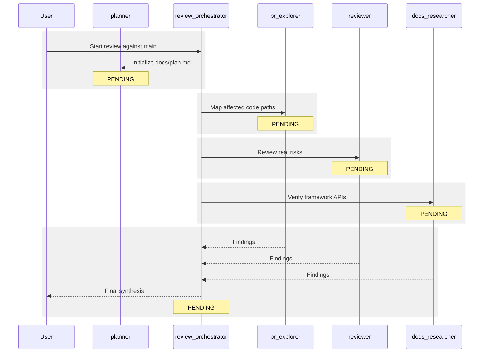

# Execution Plan

## Objective

Pending initialization by `planner`.

## Status Summary

- Overall status: `PENDING`
- Current phase: `Waiting for planner`
- Target comparison: `main`

## Participants

| Agent | Role | Status |
| --- | --- | --- |
| `planner` | Plan owner and live tracker | `PENDING` |
| `review_orchestrator` | Review coordinator | `PENDING` |
| `pr_explorer` | Code-path mapping | `PENDING` |
| `reviewer` | Risk review | `PENDING` |
| `docs_researcher` | API verification | `PENDING` |

## Tasks

| Task | Owner | Status | Notes |
| --- | --- | --- | --- |
| Initialize `docs/plan.md` | `planner` | `PENDING` | Waiting for workflow start |
| Diff branch against `main` | `review_orchestrator` | `PENDING` | Not started |
| Map affected code paths | `pr_explorer` | `PENDING` | Not started |
| Review concrete risks | `reviewer` | `PENDING` | Not started |
| Verify framework APIs | `docs_researcher` | `PENDING` | Not started |
| Synthesize final review | `review_orchestrator` | `PENDING` | Not started |

## Sequence Diagram

## Activity Log

- Waiting for the first `planner` update.

## Open Questions Or Blockers

- None.
