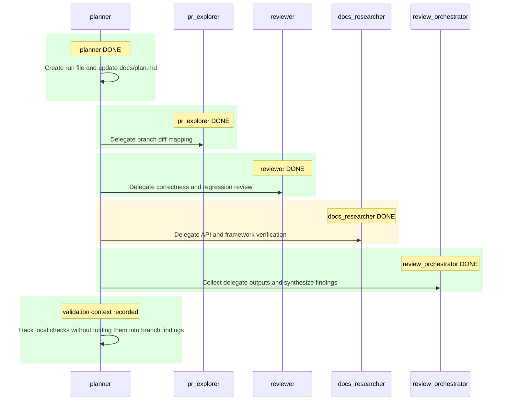

# Review Run: Current Branch vs `main`

## Objective

Review the current branch against `main` in `test-codex-cli` for correctness bugs, regressions, security risks, and missing tests.

## Run Metadata

- Repository: `C:\02 - Accenture\03 - Repositorios\test-codex-cli\test-codex-cli`
- Base branch: `main`
- Current branch: `branchdemo`
- Run file: `docs/plans/2026-03-20_12-01-57_review-main.md`
- Orchestrator: `review_orchestrator`

## Status Summary

- Overall status: `DONE`
- Active agent: `review_orchestrator`
- Next agents: `none`
- Goal state: produce ordered review findings with file and line references, plus validation limits
- Scope: `.codex/agents/*.toml`, `.codex/config.toml`, `AGENTS.md`, `docs/plan.md`, `docs/plans/README.md`, `lint.out`, `next.config.ts`, `package.json`
- Validation context: local checks are running alongside delegate work and are not yet tied to branch findings
- Docs verification context: `docs_researcher` completed; `next dev --webpack` is officially documented, `next.config.ts` webpack hook usage is supported but semver-unstable, and the real Next 16 compatibility gap is the unchanged `lint` script using `next lint`

## Participants

| Agent | Role | Status |
| --- | --- | --- |
| planner | Initialize and keep the run tracker current | `DONE` |
| pr_explorer | Map changed files and execution paths | `DONE` |
| reviewer | Identify concrete issues and missing tests | `DONE` |
| docs_researcher | Verify any framework or platform assumptions | `DONE` |
| review_orchestrator | Synthesize delegate output into final findings | `DONE` |

## Task Table

| Step | Owner | Status | Output |
| --- | --- | --- | --- |
| 1. Initialize run tracker | planner | `DONE` | New per-run plan created and pointer refreshed |
| 2. Map branch diff vs `main` | pr_explorer | `DONE` | Diff scoped to dev-server config, Codex agent config, and review-plan files; no app or test files changed |
| 3. Review correctness and regression risk | reviewer | `DONE` | Two confirmed workflow regressions identified and separated from pre-existing validation failures |
| 4. Verify framework or API assumptions | docs_researcher | `DONE` | Confirmed or rejected assumptions |
| 5. Synthesize final review | review_orchestrator | `DONE` | Final ordered findings and limitations |
| 6. Record local validation context | planner | `DONE` | Validation results tracked separately from branch findings |

## Sequence Diagram

## Activity Log

- `2026-03-20 12:01:57` planner created this run file.
- `2026-03-20 12:01:57` planner refreshed `docs/plan.md` to point at this run.
- `2026-03-20 12:01:57` planner setup completed.
- `2026-03-20 12:01:57` review_orchestrator scoped the branch diff against `main` to `.codex/agents/*.toml`, `.codex/config.toml`, `AGENTS.md`, `docs/plan.md`, `docs/plans/README.md`, `lint.out`, `next.config.ts`, and `package.json`.
- `2026-03-20 12:01:57` `pr_explorer`, `reviewer`, and `docs_researcher` launched and moved to `IN_PROGRESS`.
- `2026-03-20 12:01:57` local validation ran in parallel with delegates.
- `2026-03-20 12:01:57` `npm run lint` exited non-zero after printing only `next lint`; root cause remains unconfirmed.
- `2026-03-20 12:01:57` `node tests/components.test.mjs` failed on the existing Hero CTA assertion expecting `Download Markdown`; this remains validation context, not a confirmed branch finding.
- `2026-03-20 12:01:57` `docs_researcher` completed.
- `2026-03-20 12:01:57` docs verification confirmed `next dev --webpack` is officially documented, `next.config.ts` webpack hook usage is supported but semver-unstable, and the real Next 16 compatibility gap is the unchanged `lint` script using `next lint`.
- `2026-03-20 12:01:57` branch inspection confirmed there is no diff in `tests/components.test.mjs`, `components/Hero.tsx`, or `components/PageMarkdownActions.tsx`; the failing component test predates this branch.
- `2026-03-20 12:01:57` final synthesis completed and findings were persisted into this run file.

## Findings

1. Confirmed regression: `.codex/agents/browser_debugger.toml:13-15` changes `mcp_servers.chrome_devtools.url` from the working `http://localhost:3000/mcp` value on `main` to `http://localhost:3000`. That points the MCP client at the web app root rather than the MCP endpoint, so browser-debug sessions will fail before they can collect screenshots, console output, or network evidence.
2. Confirmed workflow regression: `.codex/agents/planner.toml:9-22` and `docs/plans/README.md:3-14` require a brand-new `docs/plans/*.md` file for every run and an updated tracked `docs/plan.md`, but the branch does not add any ignore/cleanup mechanism for those artifacts. Every review therefore dirties the worktree with transient operational state and creates a real risk of stale run history being accidentally committed.
3. Confirmed non-finding: no risky API mismatch was found for the framework changes. Official Next.js docs still document both `next dev --webpack` and the `webpack(config, options)` hook used in `next.config.ts`.

## Open Questions / Blockers

- `npm run lint` still fails in this repo because the unchanged `lint` script uses `next lint` under Next 16, but that issue predates this branch and is validation context only.
- `node tests/components.test.mjs` still fails on the unchanged Hero CTA assertion expecting `Download Markdown`, which also predates this branch.
