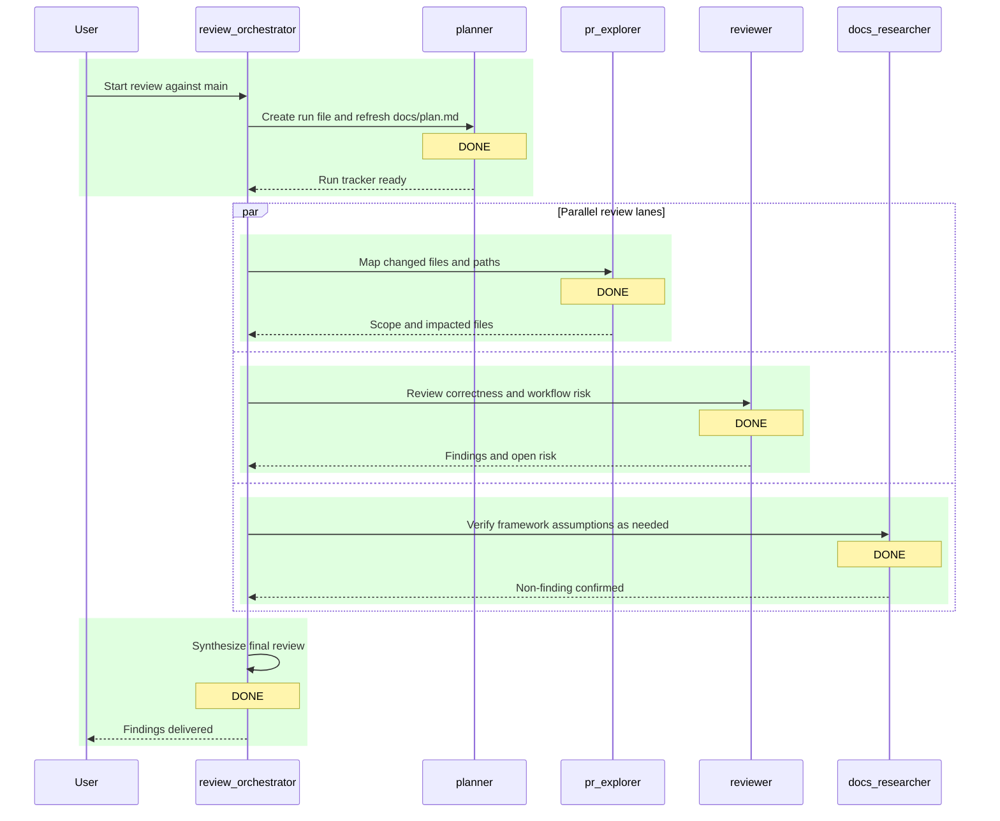

# Review Run: Current Branch vs `main`

## Objective

Review the current branch against `main` in `test-codex-cli` for correctness bugs, regressions, workflow risks, and missing validation coverage.

## Run Metadata

- Repository: `C:\02 - Accenture\03 - Repositorios\test-codex-cli\test-codex-cli`
- Base branch: `main`
- Current branch: `branchdemo`
- Run file: `docs/plans/2026-03-20_12-55-06_review-main.md`
- Orchestrator: `review_orchestrator`

## Status Summary

- Overall status: `DONE`
- Active agent: `review_orchestrator`
- Next agents: `none`
- Goal state: produce ordered review findings with evidence, severity, and non-findings called out explicitly
- Scope: `.codex/agents/*.toml`, `.codex/config.toml`, `AGENTS.md`, `docs/plan.md`, `docs/plans/*.md`, `next.config.ts`, `package.json`, `codex-lint-capture.txt`, `lint.out`
- Validation context: `npx tsc --noEmit` passed during this run

## Participants

| Agent | Role | Status |
| --- | --- | --- |
| planner | Create and maintain the run tracker | `DONE` |
| pr_explorer | Map changed files and execution paths | `DONE` |
| reviewer | Identify concrete issues and workflow regressions | `DONE` |
| docs_researcher | Verify framework assumptions where needed | `DONE` |
| review_orchestrator | Synthesize final findings | `DONE` |

## Task Table

| Step | Owner | Status | Output |
| --- | --- | --- | --- |
| 1. Initialize run tracker | planner | `DONE` | New per-run plan created and pointer refreshed |
| 2. Map branch diff vs `main` | pr_explorer | `DONE` | Diff scoped to agent config, workflow docs, dev-server config, and repo guidance |
| 3. Review correctness and workflow risk | reviewer | `DONE` | Two confirmed branch regressions and one low-confidence config risk |
| 4. Verify framework assumptions | docs_researcher | `DONE` | No framework/API mismatch required to explain the confirmed branch findings |
| 5. Synthesize final review | review_orchestrator | `DONE` | Findings and non-findings persisted |

## Sequence Diagram

## Activity Log

- `2026-03-20 12:55:06` planner created this run file.
- `2026-03-20 12:55:06` planner refreshed `docs/plan.md` to point at this run.
- `2026-03-20 12:55:06` review_orchestrator confirmed comparison target `main` is available locally and on `origin`.
- `2026-03-20 12:55:06` `pr_explorer`, `reviewer`, and `docs_researcher` reviewed the diff scope in parallel.
- `2026-03-20 12:55:06` `npx tsc --noEmit` passed, so there is no branch-level TypeScript regression in the current snapshot.
- `2026-03-20 12:55:06` review_orchestrator persisted the final findings into this run file.

## Findings

1. Medium (confirmed): `browser_debugger` is now pointed at the app root instead of the MCP endpoint, which breaks the browser-debug workflow this branch is trying to improve.
   Evidence: [browser_debugger.toml](C:/02%20-%20Accenture/03%20-%20Repositorios/test-codex-cli/test-codex-cli/.codex/agents/browser_debugger.toml#L13) sets `url = "http://localhost:3000"`, while the diff against `main` shows the previous working value was `http://localhost:3000/mcp`. With the current value, the MCP client hits the web app instead of the devtools server endpoint.

2. Medium (confirmed): The new planner/orchestrator workflow requires a fresh tracked Markdown artifact for every run, but the branch does not introduce any ignore, rotation, or cleanup path for those files, so ordinary reviews now create recurring operational diffs.
   Evidence: [planner.toml](C:/02%20-%20Accenture/03%20-%20Repositorios/test-codex-cli/test-codex-cli/.codex/agents/planner.toml#L9) requires a brand-new file under `docs/plans/` for each workflow, and [README.md](C:/02%20-%20Accenture/03%20-%20Repositorios/test-codex-cli/test-codex-cli/docs/plans/README.md#L3) formalizes that convention. This branch already adds multiple run artifacts plus an updated [plan.md](C:/02%20-%20Accenture/03%20-%20Repositorios/test-codex-cli/test-codex-cli/docs/plan.md#L1), which means normal review usage will keep dirtying the worktree with non-product state.

3. Low (open risk): The custom webpack watcher config overwrites `config.watchOptions.ignored` instead of extending it, which may unintentionally discard existing ignore patterns and widen file watching more than intended.
   Evidence: [next.config.ts](C:/02%20-%20Accenture/03%20-%20Repositorios/test-codex-cli/test-codex-cli/next.config.ts#L7) assigns a new `ignored` array directly. I did not reproduce a runtime regression from this in the current turn, so this remains a plausible risk rather than a confirmed defect.

## Non-Findings

- `npx tsc --noEmit` passes on this branch, so there is no confirmed TypeScript regression in the current snapshot.
- I did not find a framework/API mismatch that explains the confirmed findings above; they are caused by branch logic/configuration choices rather than unsupported platform behavior.

## Open Questions / Blockers

- Should run artifacts under `docs/plans/` stay tracked in git, or should they be excluded from normal review commits?
- If the watcher override is kept, should it preserve any pre-existing `watchOptions.ignored` entries explicitly?
