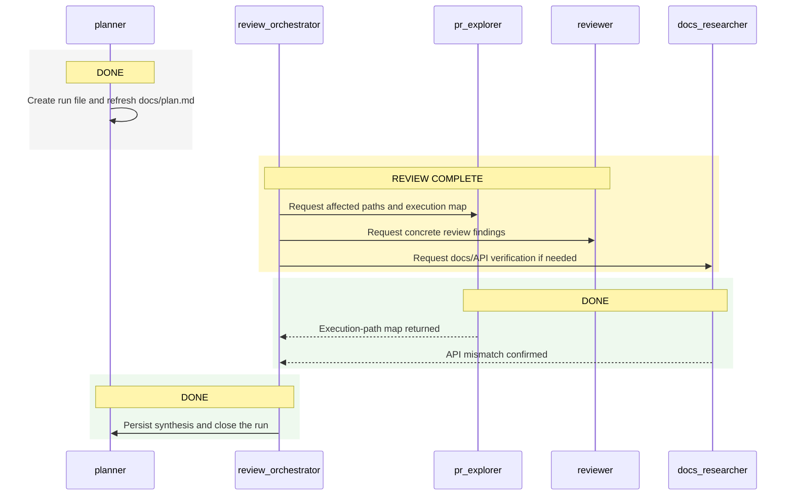

# Review Run: Current Branch vs `main`

## Objective

Review the current branch against `main` in `C:\02 - Accenture\03 - Repositorios\test-codex-cli\test-codex-cli` and capture concrete correctness, regression, and test risks.

## Run Metadata

- Run file: `docs/plans/2026-03-20_13-10-00_review-main.md`
- Comparison target: `main`
- Workspace: `C:\02 - Accenture\03 - Repositorios\test-codex-cli\test-codex-cli`
- Status: `DONE`
- Active phase: `Findings synthesized`

## Status Summary

- `planner`: `DONE`
- `review_orchestrator`: `DONE`
- `pr_explorer`: `DONE`
- `reviewer`: `DONE`
- `docs_researcher`: `DONE`

## Participants

- `planner`: creates and maintains the run plan, task table, and status tracking.
- `review_orchestrator`: coordinates the branch-vs-main review and synthesizes final findings.
- `pr_explorer`: maps the changed code paths and impacted files.
- `reviewer`: identifies concrete bugs, regressions, and missing tests.
- `docs_researcher`: verifies any framework or platform API assumptions that the patch depends on.

## Task Table

| Task | Owner | Status | Notes |
| --- | --- | --- | --- |
| Create run plan and refresh pointer | planner | `DONE` | New per-run file created; `docs/plan.md` points to it. |
| Launch review orchestration | review_orchestrator | `DONE` | Branch scoped against `main`; local diff and untracked files collected. |
| Map impacted files and execution paths | pr_explorer | `DONE` | Traced route/component/config flow; highlighted markdown export path and dev watch-ignore changes. |
| Inspect for concrete defects and regressions | reviewer | `DONE` | Returned findings for the browser debugger config, broken lint path, and weakened footer regression coverage. |
| Verify platform/framework assumptions | docs_researcher | `DONE` | Confirmed `next lint` is incompatible with pinned `next@16.1.0`; repo lint path is broken. |
| Synthesize and persist findings | review_orchestrator | `DONE` | Findings consolidated and persisted in this run file and `docs/plan.md`. |

## Mermaid Sequence Diagram

## Activity Log

- `2026-03-20 13:10` planner created this run file and updated `docs/plan.md` to point here.
- `2026-03-20 13:12` review_orchestrator scoped `branchdemo` vs `main`; diff includes site components, tests, Next config/package scripts, AGENTS docs, and untracked run artifacts.
- `2026-03-20 13:12` delegated `pr_explorer`, `reviewer`, and `docs_researcher` in parallel.
- `2026-03-20 13:15` the initial parallel spawn returned partially; `reviewer` is active and the remaining lanes are being relaunched individually to avoid losing execution-path or docs-verification coverage.
- `2026-03-20 13:14` docs_researcher confirmed `package.json` still uses removed `next lint` while repo pins `next@16.1.0`; this is a real validation regression.
- `2026-03-20 13:15` pr_explorer completed the execution map; key affected paths are `pages/index.tsx`, `components/Section.tsx`, `components/PageMarkdownActions.tsx`, `components/landingPageMarkdown.ts`, `next.config.ts`, and `tests/components.test.mjs`.
- `2026-03-20 13:17` reviewer completed with findings for the browser debugger MCP URL, the broken lint path, and weaker footer regression coverage.
- `2026-03-20 13:18` review_orchestrator confirmed the markdown export path is stale: `PageMarkdownActions` still serves `landingPageMarkdown.ts`, but `Hero.tsx` and `Footer.tsx` changed visible copy without synchronizing that payload.

## Findings

- `[P1]` `.codex/agents/browser_debugger.toml` changes the `chrome_devtools` server URL from `http://localhost:3000/mcp` to `http://localhost:3000`. The app root serves the landing page, not an MCP endpoint, so this breaks the browser debugger agent’s connection handshake and makes that tooling path unusable.
- `[P1]` `components/PageMarkdownActions.tsx` still copies/downloads `LANDING_PAGE_MARKDOWN`, but `components/landingPageMarkdown.ts` was left unchanged while `components/Hero.tsx` and `components/Footer.tsx` changed visible copy and latest-news metadata. The “Download Markdown” and “Copy as Markdown” actions now return stale content that no longer matches the page.
- `[P2]` `package.json` keeps `npm run lint` wired to `next lint` even though the repo pins `next@16.1.0`, where `next lint` has been removed. Local repro in `codex-lint-capture.txt` matches docs confirmation, so the documented validation path is broken until the script is migrated to direct ESLint/Biome wiring.
- `[P3]` `tests/components.test.mjs` weakens footer coverage by replacing the rendered-text assertion `Source: Next.js Blog` with a source-object check `source: "Next.js Blog"`. A future rendering regression in `Footer.tsx` would now pass the test as long as the backing constant still exists.

## Open Questions or Blockers

- No blocker remains for the review. Residual uncertainty is limited to runtime confirmation of the browser debugger handshake, but the endpoint regression is strongly evidenced by the config diff from `main`.
